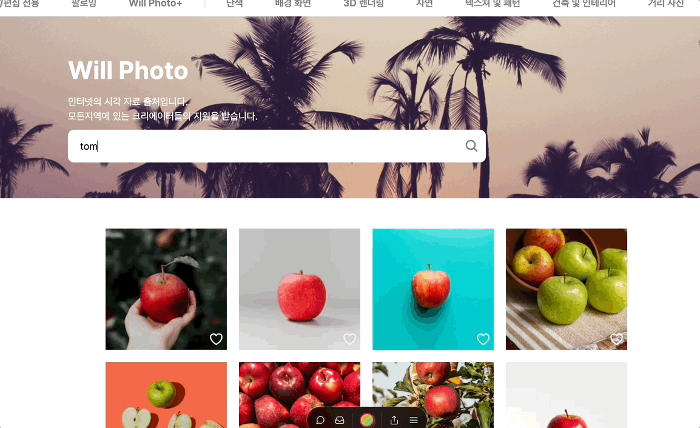
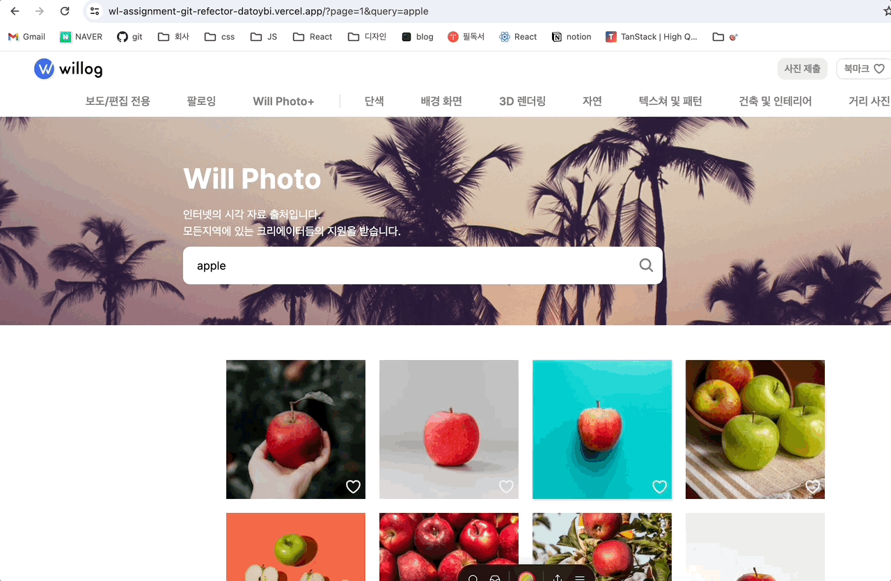

# 기술 과제 - 윤다솜

<br/>

# **Getting Started**

```
git clone https://github.com/datoybi/wl_assignment.git

npm install
npm run dev
```

<br/>

---

<br/>

# 배포 링크

[https://wl-assignment.vercel.app/](https://wl-assignment.vercel.app/)

<br/>

---

<br/>

# 기술 스택

- React (18)
- Typescript
- Nextjs (14.0.4)

<br/>

---

<br/>

# 구현 사항

### Suspenses를 이용하여 스켈레톤 로딩 화면을 구현해서 사용자 경험을 높였습니다.



<br/>

### 컴포넌트의 재사용성을 고려하였습니다.

ui/common/photo-list, ui/common/photo-item을 북마크 페이지와 메인페이지에서 공통 컴포넌트로 사용하였습니다.

header와 navbar를 공통 컴포넌트로 사용하였습니다.

<br/>

### 관심사의 분리

constants, utils, routing folder, lib으로 나누어 관심사의 분리를 하였습니다.

<br/>

### url 쿼리스트링을 이용하여 검색을 구현하였습니다.

검색어가 존재하지 않을 때는 random 사진을 가져왔습니다.


<br/>

### 반응형을 구현하였습니다.


### Context API를 사용하여 전역적으로 북마크 리스트를 관리하였습니다.

<br/>

---

<br/>

# 필수 요구 사항

### 1. 공통

- ~~헤더 로고 아이콘 클릭 시 검색 페이지로 이동합니다.~~
- ~~내비게이션의 우측 상단 북마크 버튼을 누르면 북마크 화면으로 이동합니다.~~

### 2. 검색 페이지(메인)

- ~~사용자가 찾고자 하는 이미지에 대한 쿼리를 입력하면 결과에 대한 리스트가 보입니다.~~
- ~~검색 결과에 대한 페이징 처리가 되어야 합니다.~~
- ~~검색된 이미지 클릭 시 상세 모달이 나타나야 합니다.~~
- ~~북마크 저장 여부에 따라 아이콘이 다르게 표시되어야 합니다.~~
- ~~페이지 전환 시 현재 페이지 번호와 이미지 리스트가 변경되어야 합니다.~~

### 3. 상세 모달

- ~~이미지에 대한 정보를 나타냅니다.~~
- ~~우측 북마크 버튼을 누르면 이미지가 북마크에 등록/취소됩니다.~~
- ~~모달 외부영역 클릭 혹은 좌측 X 클릭 시 상세 모달이 닫힙니다.~~

### 4. 북마크 페이지

- ~~이미지 내 북마크 버튼을 누르면 북마크 취소되고, 리스트에서 제외됩니다.~~
- ~~검색 페이지와 동기화가 이루어져야 합니다.~~
